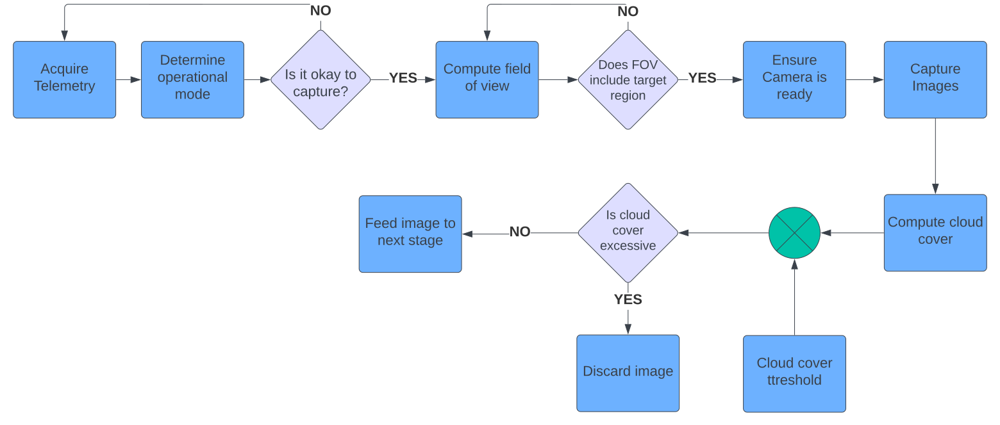

# Stage 1: Image capture and cloud detection

## The Process:

## Tasks
- [ ] Acquire telemetry from OBC
- [ ] Partition telemetry to readable values
- [ ] Compute ground track
- [ ] Predict FOV
- [ ] Determine camera's status
- [x] Detect clouds in images
- [x] Compute cloud cover
- [x] Block cloudy pixels
- [ ] Save images for next stage
